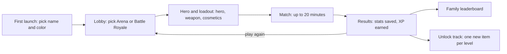
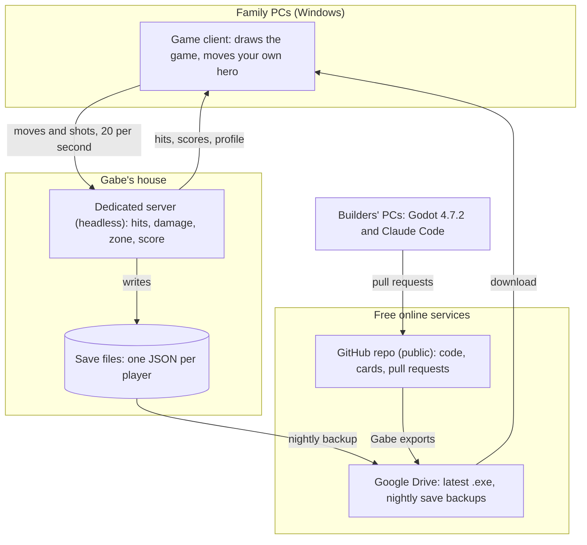
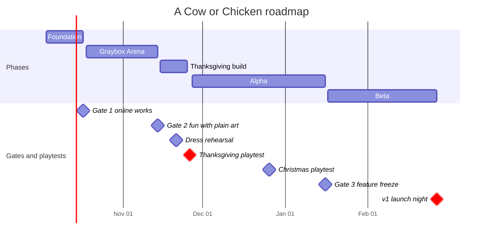

# A Cow or Chicken: Project Plan

v1.1 · Oct 6, 2026 · Owner: Gabe · Engine: Godot 4.7.2

**Bottom line:** a 2D top-down fantasy and sci-fi hero shooter for 5-16 family players. **Arena** mode ships for the Thanksgiving playtest (Thu Nov 26, 2026). **Battle Royale with unlocks** ships as v1 (Sat Feb 27, 2027). The plan fits only if each builder gives about 5 hours a week (Gabe 7 to Nov 25, then 5) and Gabe's workload stays protected. At those hours the margin is about zero, so cuts come early, not late.

[1 Decisions](#1-decisions) · [2 Expert calls](#2-expert-calls) · [3 Game design](#3-game-design-v1) · [4 Architecture](#4-architecture) · [5 Team](#5-team-and-capacity) · [6 Roadmap](#6-roadmap) · [7 Testing and release](#7-testing-and-release) · [8 Risks](#8-risks) · [9 Open decisions](#9-open-decisions)

## 1. Decisions

Made at the Oct 3 kickoff. Fixed unless the whole team agrees to change them.

| Decision | Choice |
| --- | --- |
| Working title | A Cow or Chicken |
| Game | 2D top-down hero shooter with an Apex and Dota 2 feel |
| Core moment | Picking a hero, then mixing abilities and guns |
| Theme | Fantasy and sci-fi |
| Modes | Arena (teams, respawns) at Thanksgiving; Battle Royale at v1 |
| Players | 5-10 is the smallest fun match; up to 16 at once |
| Match length | 20 minutes |
| Carries over between matches | Unlocks, weapons and cosmetics; saved stats; family leaderboard |
| Who plays | Ages 12 to 65 |
| Controls | Keyboard and mouse |
| Platform | Windows only |
| Not in v1 | 3D, voice chat, passwords, Mac, phone or console builds, purchases |
| Game server | Gabe's house |
| Budget | Claude Pro, $20/month per builder. Everything else $0 |

## 2. Expert calls

These shape the whole plan. Ordered by how badly each problem would hurt.

1. **Gabe holds the two hardest jobs** (tech lead plus Heroes & Combat: 13 of the 37 cards before Thanksgiving). Combat is data-driven so Adam builds weapons as data and John owns visuals. A 4th builder would take test bots and balance.
2. **Home hosting has three traps:** CGNAT blocks hosting, weak upload causes lag, and players in Gabe's house can't join by his public address. Test in week 1 (T03), require 10 Mbps upload, add LAN discovery. **Settled Oct 6:** cable, no CGNAT, 31 Mbps upload, UDP 7777 forwarded. Home hosting works; the cloud VM is off the table. Same-house joining still needs the LAN discovery in T10.
3. **Unlocks never add power.** Every hero is free from day one, weapon unlocks are sidegrades, cosmetics are looks only. Otherwise the 12-year-old and the 65-year-old lose every match.
4. **20-minute matches punish early deaths.** Arena's score limit is tuned so matches usually end in 12-15 minutes (20-minute cap). Battle Royale lets players redeploy until the zone's second close.
5. **15+ players in one match needs 15+ Windows PCs in one place.** Count working laptops by Nov 1; run rotations of 8-10 if short.
6. **A 12-to-65 skill spread makes fights lopsided.** Rating-based team balance, a practice range, and only four inputs at Thanksgiving: WASD, mouse, left click, Q.
7. **Three people can't test a 10-player game.** Headless test bots arrive in week 2 (T09). They are a dev tool, not the "computer bots" feature.
8. **Stats and unlocks need one trusted home.** A dedicated server at Gabe's house from week 1; saves live only there and are backed up nightly.
9. **Small lobbies on big maps feel empty.** The Battle Royale zone and loot scale with player count.
10. **Fantasy plus sci-fi art can clash.** One art pack family for everything, chosen in the T04 bake-off.
11. **The repo is public.** Never commit the server address, a join key or save files.
12. **Godot 4.8 will likely ship mid-project.** Everyone stays on 4.7.2 until after v1.

## 3. Game design (v1)

Every number below is a starting value to tune in playtests.

### Core loop



### Heroes (4 at v1)

| Hero (working name) | Role | Default weapon | Q ability (Thanksgiving) | F ultimate (v1) |
| --- | --- | --- | --- | --- |
| Fantasy Bruiser | Front line, soaks damage | Blunderbuss | Shield Charge: dash 5 tiles, knock enemies back (10 s cooldown) | Ground Slam: stun nearby enemies for 1 s |
| Fantasy Mage | Area damage | Spark Wand | Blink: teleport 5 tiles (8 s) | Meteor: large area hit after a 1.5 s warning |
| Sci-fi Scout | Fast flanker | Pulse Rifle | Jet Dash: two quick dashes (6 s each) | Overdrive: +50% fire rate and speed for 6 s |
| Sci-fi Medic | Keeps the team alive | Blaster Pistol | Heal Drone: heals nearby allies 40 HP over 4 s (14 s) | Shield Dome: blocks enemy shots for 5 s |

Names and looks are decided by John and Gabe by Oct 17, including whether the heroes are cows and chickens.

### Weapons (6 base, 6 unlockable sidegrades)

| Type | Fantasy look | Sci-fi look | Job | Unlockable sidegrade |
| --- | --- | --- | --- | --- |
| Sidearm | Hand crossbow | Blaster pistol | Backup; Battle Royale starting weapon | Charged shot: slower, harder hits |
| Rapid | Spark wand | Laser SMG | Close-range spray | Burst fire |
| Rifle | Longbow | Pulse rifle | All-round | Piercing shot: passes through one enemy |
| Spread | Blunderbuss | Scatter cannon | Close burst | Slug: one tight blast |
| Long range | Ballista | Rail gun | Picks from far away | Quick shot: faster, weaker |
| Launcher | Fire staff | Plasma launcher | Splash damage | Bouncing grenade |

Arena: players pick any unlocked weapon at hero select. Battle Royale: everyone drops with a sidearm and loots the rest. A weapon's look follows the hero's theme; its stats don't.

### Modes

| Mode | Players | Teams | Win condition | Respawn | Map | Ships |
| --- | --- | --- | --- | --- | --- | --- |
| Practice Range | 1 | None | None | Instant | One room with target dummies | Thanksgiving |
| Arena | 2-16 | 2, auto-balanced | Score limit (start at 8 x players) or 20-minute cap | 4 s, then 2 s spawn protection | About 3 x 3 screens | Thanksgiving |
| Battle Royale | 5-16 | Squads of 1-4 | Last squad standing | Redeploy until the zone's second close; knocked-down players can be revived | About 8 x 8 screens; zone starts smaller with fewer players | v1 |

### Progression and leaderboard
- XP per match: 100 for finishing, +10 per elimination, +50 for a win. A level every 1,000 XP, levels 1-30.
- Each level unlocks one item: 24 cosmetics (hats, colors, trails) plus the 6 weapon sidegrades at levels 5, 10, 15, 20, 25 and 30.
- Saved per player on the server: matches, wins, eliminations, damage, favorite hero, level, unlocks.
- Leaderboard tabs: wins, eliminations, level.
- Stats record from Thanksgiving on. At v1, saved stats convert to XP, so Thanksgiving matches still count.
- Team-balance rating: everyone starts at 1,000; +20 for a win, -20 for a loss. Teams are snake-drafted by rating.

### Controls (keyboard and mouse; defined in game/core/game.gd)

| Action | Key | At Thanksgiving |
| --- | --- | --- |
| Move | WASD (arrow keys also work) | Yes |
| Aim | Mouse | Yes |
| Fire | Left click | Yes |
| Ability | Q | Yes |
| Ultimate | F | v1 |
| Interact, revive | E | v1 |
| Reload | Automatic when empty; R at v1 | Automatic only |
| Swap weapon | 1 / 2 | v1 |
| Scoreboard | Tab | Yes |
| Menu | Esc | Yes |

### Family-friendly rules
- Blue vs orange teams (readable for color-blind players): Blue #3B82F6 and Orange #F97316. Your own hero always has an outline.
- Art mix (decided Oct 9): the world (floor, walls, cover) comes from Tiny Dungeon, on its gray stone floor, never its sand floor (too close to our orange). Fantasy heroes come from Tiny Dungeon, sci-fi heroes from the 1-Bit pack, and every hero stands on the same team-colored ring. Guns, pickups and the HUD come from the 1-Bit pack, tinted. Neither pack has bullets or rockets, so projectiles stay simple drawn shapes until T31.
- Names above every hero; damage numbers on every hit.
- UI scale setting from 100% to 150%; no text smaller than 18 px at 1080p.
- Cartoon effects only: puffs and stars, no blood.
- Practice Range is one click from the main menu.

## 4. Architecture

One headless server at Gabe's house decides everything that matters. Each family PC only draws the game and moves its own hero.



### Key technical decisions

| Area | Decision | Why |
| --- | --- | --- |
| Engine | Godot 4.7.2 stable, standard build, GDScript with static types. Compatibility renderer, 1920 x 1080 base, canvas_items stretch, keep aspect, window opens at 1280 x 720, nearest-neighbor texture filter | Current stable; text files Claude Code can edit; runs on old laptops; crisp pixel art; everyone sees the same play area |
| Server | The same project exported as a headless dedicated server, run on Gabe's PC as its own process | One codebase, one language |
| Movement | Each client moves its own hero and reports its position; the server rejects impossible speeds | Instant controls with no prediction code; cheating doesn't matter in a family game |
| Combat | The server decides hits, damage, abilities, deaths, pickups, zone and score | One source of truth |
| Bullets | The server sends spawn events (origin, direction, speed); clients draw the flight | Smooth bullets, little bandwidth |
| Sync | 20 updates a second per hero; other heroes drawn 100 ms behind with smoothing | Hides jitter on home internet |
| Transport | ENet over UDP port 7777, forwarded on Gabe's router, Windows Firewall rule on the server PC | Built into Godot, free |
| Joining | Server address in git-ignored `server.cfg`, shipped inside each build (export filter, T29); LAN discovery for same-house play; free dynamic DNS name if Gabe's IP changes | Players just click Play; no home address in the public repo |
| Version check | Client and server versions must match exactly; a mismatch says "Update from the Drive folder" | Stops half the family playing an old build |
| Identity | Random device token plus a chosen name, no passwords; a recovery code moves a profile to a new PC | Keeps "no passwords" without names colliding |
| Saves | One JSON file per player on the server, with a schema version, written to a temp file then renamed, backed up nightly | Survives crashes and updates |
| Data | Heroes, weapons, abilities, modes and unlocks are Godot Resources (.tres) | Non-coders tune numbers in the Inspector |
| Builds | Windows x64 client with data embedded (one .exe); Windows server build | One file to download |
| Budgets | 60 fps on the oldest family laptop; server under 20% CPU and 5 Mbps upload at 16 players | Measured at Gate 2; Gabe's upload must test at 10 Mbps or more |

### Repository layout

```text
README.md            start here
CLAUDE.md            rules Claude Code follows
CREDITS.md           every asset and its license
project.godot        Godot 4.7.2 project settings
.claude/skills/      /build-card and /fix-bug commands
.github/             issue and PR templates, "smoke" check workflow
docs/                plan, backlog, setup, workflow, team cards, art bake-off
prompts/             Prompt 1 for Gabe, Adam and John
tools/               smoke test (smoke.ps1 for Windows, smoke.sh for CI)
game/core/      Gabe autoloads: Events, Game, Net
game/net/       Gabe connection, sync, LAN discovery, test bots
game/heroes/    Gabe hero scenes, abilities, data
game/weapons/   Gabe weapon logic (data/ belongs to Adam)
game/maps/      Adam arena, battle royale, practice range
game/modes/     Adam Arena and Battle Royale rules, zone, loot tables
game/items/     Adam pickups and loot
game/ui/        John menus, HUD, lobby, results, leaderboard
game/players/   John profiles, cosmetics, unlock track
assets/         John art from one pack family, fonts
audio/          John sound effects, music
server/         Gabe profile store, backups, server boot
tests/          Gabe GUT unit tests
```

## 5. Team and capacity

| Person | Role | Assumed hours/week |
| --- | --- | --- |
| Gabe | Tech lead + Heroes & Combat; reviews and merges every pull request, releases, runs the server | 7 until Nov 25, then 5 |
| Adam | Maps & Modes; Arena and Battle Royale rules, zone, loot, weapon data, balance passes | 5 |
| John | Look, Sound & Players; art, sound, menus, HUD, profiles, leaderboard; runs playtests and the bug list | 4 |
| ~~4th builder (if any)~~ None (decided Oct 9) | Gabe keeps the T09 test bots | 0 |

- **Available:** 16 hours a week to Nov 25 (Gabe 7, Adam 5, John 4), then 14. Across 21 weeks to Feb 27 that is about 310 hours; minus Thanksgiving and Christmas weeks, about 280.
- **Needed:** about 80 cards at roughly 3 hours each (build, test, fix) is 240 hours, plus about 60 hours of syncs and playtests: about 300.
- **Margin is now about 20 hours short** (it was 12% when Gabe was assumed at 8 hours, then about zero with John at 5). The plan no longer fits as written; Gabe picks the cuts at the weekly sync from the cut order: ultimates, weapon sidegrades, Battle Royale squads (solo only), then Battle Royale moves to v1.1. Cut early rather than late.
- **Pre-Thanksgiving cuts.** The cut order above only removes Alpha and v1 work, so it frees no time before Nov 26. These two rules do:
  - T08 builds its weapon on a WeaponData resource from the start, so T13 only adds HeroData.
  - If T14 isn't merged by Sun Nov 1, T18 ships one hero (Sci-fi Scout), and Mage and Medic move to Alpha.
- **Gabe's weeks 3 and 4 are the pinch.** Four of his cards fall in each (T07, T08, T13, T14, then T09, T18, T21, T22): about 12 hours of work against 7 available. Move cards out or accept slipping into weeks 4 and 5.
- **Critical path:** Gabe's online foundation (T06-T08) blocks online testing. Adam and John start with work that doesn't need it.
- **Plan B for Thanksgiving:** if Gabe loses two or more weeks, ship a LAN-only Arena with 2 heroes and placeholder art.
- **Claude limits:** Gabe will use the most Claude Code. If he hits his Pro limit 3+ days a week, move cards to others first; upgrading only his plan is the fallback.

## 6. Roadmap



| Gate | Date | Pass when | If it fails |
| --- | --- | --- | --- |
| Gate 1 | Sat Oct 17 | T06 merged; John and Adam join Gabe's server from their own houses; art pack picked | Fix hosting before anything else |
| Gate 2 | Sat Nov 14 | An 8-player Arena match with plain art is fun and has no crash bugs | Change the rules before adding art, or switch to Plan B |
| Gate 3 | Sat Jan 16 | Every v1 feature works end to end | After this date, only fixes and balance |

Cadence: a 30-minute sync every week, merges on three fixed days a week, family playtests at Thanksgiving, Christmas and launch.

## 7. Testing and release

| Layer | What it is | Who | When |
| --- | --- | --- | --- |
| Smoke test | `tools/smoke.ps1`: imports the project, runs it headless, fails on any script error (T09 adds server + 2 bots) | Claude Code | After every change, and on every pull request (GitHub "smoke" check) |
| Unit tests | GUT tests for damage, XP math, zone timing, save and load | Gabe | Every rules change |
| Two-window test | Server plus 2 game windows on one PC | Card owner | Every card from T06 on |
| Bot load test | 12-16 headless bots for 10 minutes, watching server CPU and upload | Gabe | Weekly after Gate 1 |
| Internal playtest | Builders plus bots for 20 minutes; each logs their top 3 problems | All | Weekly, after the sync |
| Family playtest | Practice range, 3 matches, a 5-question survey | John | Thanksgiving, Christmas, launch night |

**Family playtest script (John):** 2-minute intro with the printed controls card; 5 minutes in the practice range; 3 matches, shuffling teams after each; five questions (How fun, 1 to 5? What confused you? Favorite hero? What would you add? Play again next week?); that night, turn the notes into cards.

**Release checklist (Gabe, every release):**
1. Bump `application/config/version` in project settings.
2. Export the client (.exe with data embedded) and the server build.
3. Run the smoke test and a 10-minute bot test on the exported builds.
4. Upload the client to the Drive folder "A Cow or Chicken / Latest"; move the old one to "Previous".
5. Stop the server, back up the saves, start the new server build.
6. Post in the family chat: version, what's new, the link.

**Server runbook (Gabe's PC):** pause OneDrive, backups and video calls while hosting, since anything that maxes the upload adds about 80 ms of lag for every player; a desktop shortcut starts the headless server; Windows never sleeps while it runs; Task Scheduler copies the saves folder to Google Drive every night at 3 a.m.; to restore, stop the server, copy the backup over the saves folder, start it again. If the server is down at a gathering, run the server build on any laptop there; LAN discovery finds it.

**Family install guide (one page, John):** open the Drive link and download the game; if Windows says "Windows protected your PC", click More info, then Run anyway; if Windows asks about network access, click Allow; pick a name and a color, then click Play.

## 8. Risks

Reviewed by John at every weekly sync.

| # | Risk | Severity | Early warning | Mitigation | Owner |
| --- | --- | --- | --- | --- | --- |
| 1 | Gabe overloaded or unavailable | High | His cards slip two weeks in a row | Data-driven combat, a 4th builder, Plan B for Thanksgiving | Gabe |
| 2 | Home hosting fails: CGNAT, slow upload, same-house joining | ~~High~~ Low | ~~T03 fails~~ T03 passed Oct 6 | Hosting confirmed: cable, no CGNAT, 31 Mbps up. Cloud VM no longer needed. Still open: same-house joining needs LAN discovery (T10), and the server PC should be wired before the playtest | Gabe |
| 3 | Scope creep | High | New ideas land in "This week"; Alpha slips past Jan 16 | Later list, Jan 16 feature freeze, the cut order in section 5 | All |
| 4 | Not enough PCs at Thanksgiving | High | Fewer than 10 laptops named by Nov 1 | Borrow laptops; rotations of 8-10; practice range for waiting players | John |
| 5 | Skill gap ruins it for casual players | Medium | Youngest or oldest players rate fun under 3 | Rating-based balance, sidegrade-only unlocks, spawn protection | Adam |
| 6 | Online play feels laggy | Medium | Playtesters report late hits | Slower visible bullets; draw your own shots instantly while the server still decides hits. Gabe's line jumps 25 ms to 107 ms when its upload is maxed, so pause OneDrive, backups and video calls while hosting | Gabe |
| 7 | Family on mismatched versions | Medium | Players can't join after a release | Exact version check with a clear message, one Drive link, a release post | Gabe |
| 8 | Wi-Fi congestion at Thanksgiving | Medium | Stutter at the Nov 21 dress rehearsal | Server on a wired PC, 5 GHz Wi-Fi, fewer other devices online | Gabe |
| 9 | Art looks inconsistent | Medium | Bake-off screenshots don't match | One pack family; John approves every new asset | John |
| 10 | Claude Code limits or poor output | Medium | A builder is blocked 3+ days a week, or cards need rework | Small cards, one per session, /clear between cards, Opus only for hard bugs | All |
| 11 | Merge conflicts in scenes | Medium | Two pull requests touch the same .tscn | Folder ownership, one scene owner per week, pull main daily | Gabe |
| 12 | Motivation dip over the holidays | Medium | Missed syncs in December | Christmas playtest, weekly progress clips in the family chat | John |
| 13 | Save data loss | Low | The nightly backup task fails | Nightly backups; restore drill in Beta (B06) | Gabe |

## 9. Open decisions

| Decision | Owner | Due | Decided, or the default if not |
| --- | --- | --- | --- |
| ~~Who is tech lead~~ **Decided Oct 6** | Gabe | Oct 4 | **Gabe.** |
| ~~Weekly sync day and time~~ **Decided Oct 6** | All | Oct 4 | **Thursday 5:00 pm**, 30 minutes. |
| Real hours per week per person | All | Oct 4 | **Gabe 7 until Nov 25, then 5** (decided Oct 6). **John 4** (T02, Oct 9). Adam still to confirm in T02. |
| ~~Is there a 4th builder, and in which role~~ **Decided Oct 9** | Gabe | Oct 10 | **No 4th builder; Gabe keeps the T09 test bots.** |
| ~~Gabe's internet: type, upload speed, CGNAT~~ **Decided Oct 6 (T03)** | Gabe | Oct 10 | **Cable (Xfinity), 31 Mbps upload, no CGNAT. Home hosting is confirmed; no cloud VM needed.** |
| ~~Repo stays public or goes private~~ **Decided Oct 9** | Gabe | Oct 10 | **Public, with the server address and saves git-ignored.** |
| ~~Art pack family~~ **Decided Oct 8 (T04), mix decided Oct 9** | John | Oct 17 | **Both packs: A (Kenney 1-Bit Pack) and B (Kenney Tiny Dungeon).** World (floor, walls, cover) and fantasy heroes from Tiny Dungeon, on its gray stone floor (never the sand floor); sci-fi heroes, guns, pickups and the HUD from 1-Bit, tinted; every hero on the same team-colored ring. Projectiles are simple drawn shapes until T31. See Family-friendly rules. |
| Hero names and looks; cows and chickens or not | John, Gabe | Oct 17 | The working names in section 3 |
| Final key bindings | Gabe | Oct 24 | As in the Controls table |
| Thanksgiving location and laptop count | John | Nov 1 | Gabe's house, server on site |
